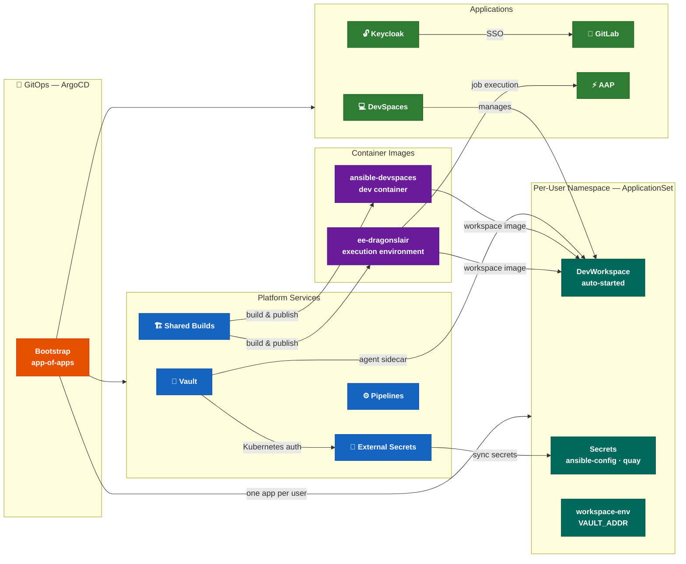

# AnsibleForge

**A GitOps-driven Ansible development environment on OpenShift — batteries included.**

AnsibleForge provisions a complete Ansible development platform on OpenShift from a single ArgoCD application.
It combines purpose-built developer containers, a custom Execution Environment, and a full suite of GitOps-managed infrastructure so teams can start writing and running automation from a browser tab.

## What you get

### For developers

- A browser-based [DevSpaces](infrastructure/devspaces.md) workspace pre-loaded with every Ansible tool, cloud CLI, and IDE extension you need
- Vault secrets automatically injected into your workspace — no manual credential setup
- Persistent storage and per-user namespace isolation
- The [ansible-devspaces](containers/ansible-devspaces.md) container: Ansible dev tools, Terraform, AWS CLI, OpenShift CLI, Helm, Podman, PowerShell, Claude Code, and 30 Ansible collections

### For operators

- Everything deployed and reconciled by ArgoCD — one bootstrap Application deploys the entire stack
- [HashiCorp Vault](infrastructure/vault.md) auto-initialized, unsealed, and configured on first boot
- [External Secrets Operator](infrastructure/external-secrets.md) with two backends: HashiCorp Vault and AWS Secrets Manager (provisioned via Cloud Credentials Operator)
- Per-user workspace provisioning via ArgoCD ApplicationSet — adding a user is a one-line git change
- [Shared Builds](infrastructure/shared-builds.md) keeping container images fresh in the internal registry

## Architecture



## Repository layout

```
ansibleforge/
├── helm/                    # RHDP Field Content CI entry point (ansible-runner Job chart)
├── containers/
│   ├── ansible-devspaces/   # Developer container image
│   └── ee-dragonslair/      # Ansible Execution Environment
├── devspaces-template/      # DevSpaces devfile template
└── ocp/
    ├── ansible/             # Ansible playbooks + collections requirements
    │   └── gitops_deploy.yml# Installs GitOps operator and bootstraps ArgoCD
    └── gitops/
        ├── bootstrap/       # ArgoCD Application manifests (app-of-apps)
        ├── vault/           # HashiCorp Vault Helm chart
        ├── external-secrets/# ESO operator + ClusterSecretStores
        ├── shared-builds/   # BuildConfigs + ImageStreams
        ├── devspaces/       # CheCluster + DevSpaces operator
        ├── user-devspace/   # Per-user Helm chart (namespace, secrets, DevWorkspace)
        ├── user-projects/   # ApplicationSet + ArgoCD RBAC
        ├── pipelines/       # OpenShift Pipelines operator
        ├── gitlab/          # GitLab operator
        ├── keycloak/        # Keycloak operator
        └── aap/             # Ansible Automation Platform operator
```
